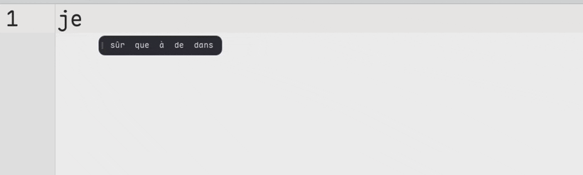

# predictive-ime

Predictive French/English input method for [fcitx5](https://fcitx-im.org/).
A small fcitx5 engine queries a local n-gram daemon for completion,
autocorrection, next-word prediction and an emoji picker. Offline, no telemetry.



> Typing `je vais au travail aujourd'`, accepting the `aujourd'hui` completion, then **Super+;** `coeur` → ❤️. The candidate bar shows at most five ranked suggestions.

The core runs on any stock fcitx5 (using its default candidate bar). The
optional caret-positioned Qt Quick candidate bar is a separate project:
[fcitx5-qmlpanel](https://github.com/titoo-dev/fcitx5-qmlpanel).

## Install

**1. Dependencies**

- Arch: `pacman -S --needed base-devel cmake extra-cmake-modules fcitx5 nlohmann-json qt6-base qt6-declarative curl`
- Fedora: `dnf install gcc-c++ cmake extra-cmake-modules pkgconf-pkg-config fcitx5-devel nlohmann-json-devel qt6-qtbase-devel qt6-qtdeclarative-devel libcurl-devel`
- Debian/Ubuntu: `apt install build-essential cmake extra-cmake-modules pkg-config nlohmann-json3-dev qt6-base-dev qt6-declarative-dev libfcitx5core-dev libfcitx5utils-dev libfcitx5config-dev libcurl4-openssl-dev`
- openSUSE: `zypper install gcc-c++ cmake extra-cmake-modules pkg-config fcitx5-devel nlohmann_json-devel qt6-base-devel qt6-declarative-devel libcurl-devel`

**2. Build and install**

```sh
cmake -B build
cmake --build build -j
sudo cmake --install build
```

**3. Get the model**

```sh
sudo mkdir -p /usr/share/ime-predictord
curl -fsSL https://github.com/titoo-dev/predictive-ime/releases/download/model-v1/ime-model-model-v1.tar.zst \
  | zstd -d | sudo tar -C /usr/share/ime-predictord -xf -
```

**4. Enable**

```sh
systemctl --user enable --now ime-predictord.service
```

Add `Predict` as an input method (e.g. with `fcitx5-configtool`) and restart fcitx5.

## Configuration

Settings live in `~/.config/ime-predictord/` (hot-reloaded): `config.json`,
`snippets.tsv`, `dict.txt`. The `ime-preferences` app edits `config.json`.

**Language.** `lang` in `config.json` picks the suggestion language: `fr` / `en`
(deterministic, the other language is strictly excluded), `auto` (context
vote), `off`. **Ctrl+Shift+L** opens a compact language switcher in the
candidate bar — [Français|English|Auto|Libre] chips with the current choice
highlighted; arrows/Tab navigate, `1-4`/Enter/Space apply, Escape cancels.
The engine rewrites `lang` in place (formatting preserved), the daemon
hot-reloads it, and the bar restarts in the new language. English
contractions (`don't`, `i'm`, `you're`…) are first-class vocabulary: completed
from `don`, restored from `dont`/`im`/`cant`, and `i`/`i'…` are always
capitalised to `I`/`I'…`.

**Grammatical agreement.** The daemon boosts candidates that agree in number
and gender with the governing determiner found in the surrounding sentence
(`les petits chat…` → `chats`), using the Lefff morphological lexicon
(`morph.tsv`). `agreeBoost` in `config.json` (default `2.0`) tunes the strength
(higher = more aggressive agreement). The engine feeds the full sentence via the
toolkit's *surrounding text*; apps that don't expose it degrade to the words the
IME itself committed.

**Recency cache.** Words already present in the text before the cursor (the
document you are writing, seen through the toolkit's *surrounding text*) are
boosted — human text repeats itself (proper nouns, topic vocabulary), so a word
you already used is likely to come back. `recencyBoost` in `config.json`
(default `1.3`) tunes the strength; `1.0` disables it. The word immediately
before the cursor is never boosted (no `the the`).

**Learned words.** Words you commit are learned and ranked **on the model's own
scale** (no overriding floor): a trusted learned word is treated as having an
effective frequency of at least a baseline, multiplied by its usage confidence —
so a rarely-learned word surfaces above ordinary words but never above a
massively more frequent one (`j'ai`), while a heavily-used one climbs past it.
`learnedBoost` in `config.json` (default `1.0`) scales how aggressive learned
suggestions are; `learnedFloor` (default `150000`) is the minimum effective
frequency a trusted learned word is treated as having (raise either if your
learned words feel too weak on your corpus).

**Bare elision proclitics.** Typing `j'` proposes `j'ai`/`j'aime` ahead of the
bare proclitic `j'` (rarely the intended final word). `proclisisDemote`
(default `6.0`) divides the score of a bare proclitic form (`j'`, `c'`, `qu'`,
`d'`, `n'`, `s'`, `t'`, `m'`, `l'`) when you typed exactly that proclitic.

**Emoji picker.** Always on, opened with **Super+;** at any point: empty
buffer, mid-word (the word in progress is committed as typed), or with the
next-word bar open; pressing it again closes the picker. It works **even when
the predictive input method is not the active one** (the addon watches the
shortcut before any input method, switches to `predict` and opens the picker),
so no Ctrl+Space first. The switch is a **loan**: as soon as the picker closes
(emoji inserted, Escape, shortcut pressed again, focus lost) your previous
input method is restored, so picking an emoji never leaves text prediction
turned on. It is a Material 3 surface with its own search field,
so the query stays in the picker and is never typed into your document. Type a
CLDR keyword (`coeur`, `soleil`, `fire`…) to filter the grid, or pick straight
from your recently-used favourites. Up to 96 results, **24 per page**: arrows
move cell by cell and by row, spilling over to the next/previous page at the
edges, PgDn/PgUp jump a page, Home/End go to either end, and the current page
shows as `2/4` in the search field. Enter inserts, Escape closes without
inserting anything. A typed `:` is a plain character everywhere (`10:30`).

**French typography (opt-in).** `frenchSpacing` (default `false`) inserts a
narrow no-break space (U+202F) before `;` `:` `!` `?` and the closing guillemet
`»`, and after the opening guillemet `«` — absorbing a regular space you already
typed. `autoCapitalize` (default `false`) capitalises the first letter at the
start of a field and after a sentence end (`. ! ?`), detected from the
surrounding text; it only touches the first letter (acronyms stay intact).

**Speculative bar in terminals.** The next-word bar shown *between* words has no
preedit to anchor it to the cursor, so in some terminals it trails behind the
caret. `nextWordBarExclude` (default `[]`) is a list of program substrings
(case-insensitive, matched against the client's program/app-id) for which that
speculative bar is suppressed — the inline completion bar (anchored to the
preedit while you type) is kept. Example: `"nextWordBarExclude": ["ghostty"]`.
Set `nextWordBar` to `false` to disable the speculative bar everywhere.

## Rebuild the model

`./build-model.sh <output-dir>` rebuilds it from the pinned open corpora.

## License

Code: MIT ([LICENSE](LICENSE)). Model: CC BY-SA 4.0, derived from open corpora —
see [NOTICE-DATASETS.md](NOTICE-DATASETS.md).

Design notes, algorithm and benchmarks: [docs/internals.md](docs/internals.md).
Contributing: [CONTRIBUTING.md](CONTRIBUTING.md).
