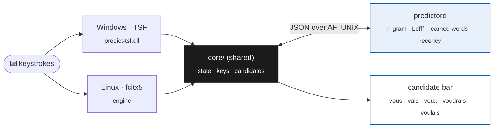
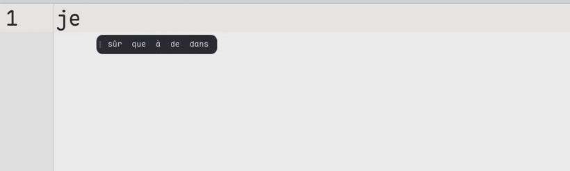

<div align="center">


# Predict

**Écrivez plus vite. Sans rien envoyer.**

Predictive French / English input for **Windows** (native TSF text service) and **Linux** (fcitx5).<br/>
Word completion, next-word prediction, autocorrection, grammatical agreement and an emoji picker,<br/>
powered by a local n-gram daemon. Offline. No telemetry.

[](LICENSE) [](NOTICE-DATASETS.md) [](#install-windows-10-1803--11) [](#install-linux--fcitx5) [](https://github.com/titoo-dev/predictive-ime/actions/workflows/build.yml)

<br/>

<a href="site/public/predict-motion.mp4">
  
</a>

<sub>36 seconds, no sound needed. Source: <a href="video/">video/</a> (HyperFrames). The <a href="site/">site/</a> folder holds the landing page.</sub>

<br/><br/>

[**Install on Windows**](#install-windows-10-1803--11) · [**Install on Linux**](#install-linux--fcitx5) · [Features](#what-it-does-while-you-type) · [How it works](#how-it-works) · [Configuration](#configuration) · [Internals](docs/internals.md)

</div>

<br/>

## What it does while you type

A candidate bar with **at most five ranked suggestions**. Space applies the outlined one, digits pick another, and everything else is just typing.

<table>
<tr>
<td width="33%" valign="top">

**🔵 Word completion**<br/>
`aujourd'` → `aujourd'hui`. Up to five candidates, ranked by the model and by your own usage.

</td>
<td width="33%" valign="top">

**🟣 Next word**<br/>
As soon as you validate a word, a local n-gram proposes the next one, with the whole sentence as context.

</td>
<td width="33%" valign="top">

**🟢 Autocorrection**<br/>
`dont` → `don't`, `im` → `I'm`, forgotten accents restored, without leaving the keyboard.

</td>
</tr>
<tr>
<td valign="top">

**🟠 Grammatical agreement**<br/>
`les petits chat` → `chats`. The Lefff lexicon agrees gender and number with the governing determiner.

</td>
<td valign="top">

**🩷 Learns your words**<br/>
First names, jargon, verbal tics: learned on the fly and re-ranked on the model's own scale, never above `j'ai`.

</td>
<td valign="top">

**💚 Emoji by name**<br/>
`coeur` → ❤️, `feu` → 🔥. One shortcut, a CLDR keyword, Enter. Favourites first, 24 per page.

</td>
</tr>
<tr>
<td valign="top">

**🌐 French, English or auto**<br/>
**Ctrl+Shift+L** switches language in the bar. English contractions are first-class vocabulary.

</td>
<td valign="top">

**📄 Document memory**<br/>
Words already before the cursor are boosted: text repeats itself, proper nouns and topic vocabulary come back.

</td>
<td valign="top">

**✒️ French typography**<br/>
Narrow no-break space before `; : ! ?` and inside « », auto-capitalisation after a sentence end. Opt-in.

</td>
</tr>
</table>

> **Private by construction.** A predictive keyboard sees everything you write, so Predict talks to no one: no account, no server, no network request. The model lives in a local folder; learned words live in a journal you can read and delete.

## How it works

One shared core, two frontends, one local daemon.


```mermaid
flowchart LR
    K([⌨️ keystrokes]) --> TSF["Windows · TSF<br/><sub>predict-tsf.dll</sub>"]
    K --> F5["Linux · fcitx5<br/><sub>engine</sub>"]
    TSF --> CORE["core/ (shared)<br/><sub>state · keys · candidates</sub>"]
    F5 --> CORE
    CORE <-- "JSON over AF_UNIX" --> D["predictord<br/><sub>n-gram · Lefff · learned words · recency</sub>"]
    CORE --> BAR["candidate bar<br/><sub>vous · vais · veux · voudrais · voulais</sub>"]
    style CORE fill:#1b1b1b,color:#fff,stroke:#1b1b1b
    style D fill:#e8f1fb,stroke:#005fb8
    style BAR fill:#fff,stroke:#005fb8
```

The frontends send one line of JSON (`context`, `prefix`, surrounding text) over a Unix socket; the daemon answers with five candidates in a few milliseconds. Settings are hot-reloaded. Design notes, algorithm and benchmarks: [docs/internals.md](docs/internals.md).

## Install (Windows 10 1803+ / 11)

Windows gets a native **TSF text service** (`predict-tsf.dll`) in place of the fcitx5 engine, plus the same `predictord` daemon. Both frontends share the input logic in [`core/`](core/) — see the [Windows port design](docs/specs/2026-09-11-windows-tsf-port-design.md).

**Easiest: the installer**

```powershell
.\dist\predictive-ime-0.1.0-x64.exe
```

It installs the text service under Program Files (a TSF DLL is loaded into every application, so it must live where an unprivileged process cannot rewrite it), registers it, grants `ALL APPLICATION PACKAGES` read access so Store apps can load it, sets up the model and the daemon's logon task, and adds **Predict** to your input methods so it shows up in **Win+Space** right away. Build it yourself with `iscc packaging\windows\predictive-ime.iss` (Inno Setup 6.6+ gives the wizard a dark mode that follows Windows).

**Or from source**

```powershell
winget install Microsoft.VisualStudio.2022.BuildTools `
  --override "--passive --wait --add Microsoft.VisualStudio.Workload.VCTools --includeRecommended"
winget install Meta.Zstandard Git.Git

.\scripts\build-windows.ps1          # predictord.exe + predict-tsf.dll
.\scripts\setup-windows.ps1          # model, logon task, IME registration
Start-ScheduledTask -TaskName ime-predictord
```

The Build Tools ship their own CMake and Ninja; vcpkg (`nlohmann-json`, `curl`) is bootstrapped by the build script. Run `setup-windows.ps1` from an **elevated** shell to have it register the text service; otherwise it prints the one `regsvr32` command to run yourself.

Then pick **Predict** with **Win+Space** and start typing.

<details>
<summary><b>What it looks like on Windows</b></summary>

The candidate bar is drawn with Direct2D/DirectWrite to match Windows 11 menus: rounded corners, shadow and border from DWM, your **accent color**, light/dark theme and **high contrast** followed live, color emoji, and text that stays sharp at any scaling, including in apps that don't handle DPI. The same three layouts as `qmlpanel`: word chips (the one Space will apply is outlined in the accent color), the emoji grid, and a numbered list for reformulation. The highlight slides between candidates; animations respect *Settings › Accessibility › Animation effects*. On Windows 10 the bar keeps square corners. For emoji on Windows, use **Win+;** — Windows keeps that shortcut for its own emoji panel, so the Linux **Super+;** picker does not apply there, and `:` types a plain colon on both systems.

A **Predict** icon sits next to the language indicator on the taskbar: click it to pause or resume prediction in every app at once (the choice persists across reboots); right-click for settings and help.

To preview the bar without installing anything:

```powershell
cmake --build build-win-x64 --config Release --target candidate-preview
$env:IME_PANEL_THEME = 'dark'   # or light; default: the Windows theme
.\build-win-x64\win\tools\Release\candidate-preview.exe $env:TEMP
```

It captures every layout (plus the taskbar icon) as PNGs.

</details>

<details>
<summary><b>Keyboard layout</b></summary>

A text service has no layout of its own: unless told otherwise, Windows hands Predict **US QWERTY**, whatever you picked (shortcuts included: Ctrl+Z on AZERTY arrived as Ctrl+W). Registration therefore declares your layout for each profile — TSF only accepts a layout *of the profile's language*: French + AZERTY works, English + AZERTY cannot. Setup only offers Predict under languages where it will type like you (Predict FR predicts English too). The taskbar icon's tooltip and menu show the layout actually in use.

The bar stays anchored to the word being typed: when an app has no layout yet (Firefox and Chrome often answer `TS_E_NOLAYOUT` on a word's first letter) it keeps its last position instead of jumping, and it follows the text when the window moves or scrolls.

</details>

<details>
<summary><b>Check the daemon on its own</b></summary>

```powershell
.\scripts\probe-daemon.ps1 -Context je -Prefix v
# -> {"candidates":["vous","vais","veux","voudrais","voulais"], ...}
.\scripts\try-daemon.ps1             # interactive tester in the terminal
```

`probe-daemon.ps1` is the Windows stand-in for `nc -U`: same line-delimited JSON over the same **AF_UNIX** socket (native since Windows 10 1803) that the text service uses. `try-daemon.ps1` is a terminal REPL that shows suggestions as you type — handy to judge the model without switching input method.

Regression tests (also run by CI): `ctest --test-dir build-win-x64 -C Release`. `win-layout-installed` checks the IME *installed on your machine* — Predict must stay the active input method and type with your own layout; it is skipped where Predict is not installed.

</details>

<details>
<summary><b>Where things live, uninstall, known limits</b></summary>

`%LOCALAPPDATA%\ime-predictord\` holds the model, the socket, the daemon log and the learned-word journals; `%APPDATA%\ime-predictord\` holds the editable settings (`config.json`, `dict.txt`, `snippets.tsv`) — the same split as XDG data vs. config on Linux. `.\scripts\setup-windows.ps1 -Uninstall` unregisters the IME and removes the logon task, leaving both directories intact.

The Qt preferences app and the Wayland `qmlpanel` are not ported — the candidate bar is drawn by the text service itself, and settings are edited in `config.json` (the taskbar icon's *Réglages…* opens it). The neural predictor is off, as on Linux.

</details>

## Install (Linux / fcitx5)

The core runs on any stock fcitx5 (using its default candidate bar). The optional Qt Quick candidate bar (`qmlpanel`) needs a patched fcitx5 — see [docs/patched-fcitx5.md](docs/patched-fcitx5.md).

**1. Dependencies**

| Distro | Packages |
|---|---|
| Arch | `pacman -S --needed base-devel cmake extra-cmake-modules fcitx5 nlohmann-json qt6-base qt6-declarative curl` |
| Fedora | `dnf install gcc-c++ cmake extra-cmake-modules pkgconf-pkg-config fcitx5-devel nlohmann-json-devel qt6-qtbase-devel qt6-qtdeclarative-devel libcurl-devel` |
| Debian / Ubuntu | `apt install build-essential cmake extra-cmake-modules pkg-config nlohmann-json3-dev qt6-base-dev qt6-declarative-dev libfcitx5core-dev libfcitx5utils-dev libfcitx5config-dev libcurl4-openssl-dev` |
| openSUSE | `zypper install gcc-c++ cmake extra-cmake-modules pkg-config fcitx5-devel nlohmann_json-devel qt6-base-devel qt6-declarative-devel libcurl-devel` |

**2. Build and install**

```sh
cmake -B build -DBUILD_UI=OFF
cmake --build build -j
sudo cmake --install build
```

**3. Get the model**

```sh
sudo mkdir -p /usr/share/ime-predictord
curl -fsSL https://github.com/titoo-dev/predictive-ime/releases/download/model-v1/ime-model-model-v1.tar.zst \
  | zstd -d | sudo tar -C /usr/share/ime-predictord -xf -
```

**4. Enable**

```sh
systemctl --user enable --now ime-predictord.service
```

Add `Predict` as an input method (e.g. with `fcitx5-configtool`) and restart fcitx5.

<div align="center">

<br/>
<sub>Typing <code>je vais au travail aujourd'</code>, accepting <code>aujourd'hui</code>, then <b>Super+;</b> <code>coeur</code> → ❤️.</sub>
</div>

## Configuration

Settings live in `~/.config/ime-predictord/` on Linux and `%APPDATA%\ime-predictord\` on Windows, hot-reloaded: `config.json`, `snippets.tsv`, `dict.txt`. On Linux the `ime-preferences` app edits `config.json`.

| Key | Default | What it does |
|---|---|---|
| `lang` | `auto` | `fr` / `en` (deterministic, the other language strictly excluded), `auto` (context vote), `off`. **Ctrl+Shift+L** opens a [Français \| English \| Auto \| Libre] switcher in the bar; the engine rewrites `lang` in place. |
| `agreeBoost` | `2.0` | Strength of the gender/number agreement boost (Lefff `morph.tsv`). Higher = more aggressive. |
| `recencyBoost` | `1.3` | Boost for words already present before the cursor. `1.0` disables it. The word right before the cursor is never boosted (no `the the`). |
| `learnedBoost` | `1.0` | How aggressive learned words are. |
| `learnedFloor` | `150000` | Minimum effective frequency a trusted learned word is treated as having. |
| `proclisisDemote` | `6.0` | Divides the score of a bare proclitic (`j'`, `c'`, `qu'`, `d'`, `n'`, `s'`, `t'`, `m'`, `l'`) so `j'ai` beats `j'`. |
| `frenchSpacing` | `false` | Narrow no-break space (U+202F) before `; : ! ?` and `»`, after `«`, absorbing a regular space you typed. |
| `autoCapitalize` | `false` | Capitalise the first letter of a field and after `. ! ?`, from the surrounding text. Only the first letter (acronyms stay intact). |
| `nextWordBar` | `true` | Set to `false` to disable the speculative between-words bar everywhere. |
| `nextWordBarExclude` | `[]` | Program substrings (case-insensitive) for which the speculative bar is suppressed, e.g. `["ghostty"]` for terminals where it trails the caret. The inline completion bar is kept. |

<details>
<summary><b>More on the emoji picker</b></summary>

Always on, opened with **Super+;** (Linux) or **Win+;** (Windows) at any point: empty buffer, mid-word (the word in progress is committed as typed), or with the next-word bar open; pressing it again closes the picker. On Linux it works **even when the predictive input method is not the active one**: the addon watches the shortcut before any input method, switches to `predict`, and restores your previous input method as soon as the picker closes — picking an emoji never leaves text prediction turned on. It is a Material 3 surface with its own search field, so the query never lands in your document. Type a CLDR keyword (`coeur`, `soleil`, `fire`…) to filter the grid, or pick from your recently-used favourites. Up to 96 results, **24 per page**: arrows move cell by cell and by row, PgDn/PgUp jump a page, Home/End go to either end, and the current page shows as `2/4` in the search field. Enter inserts, Escape closes. A typed `:` is a plain character everywhere (`10:30`).

</details>

<details>
<summary><b>How learned words are ranked</b></summary>

Words you commit are learned and ranked **on the model's own scale** (no overriding floor): a trusted learned word is treated as having an effective frequency of at least `learnedFloor`, multiplied by its usage confidence — so a rarely-learned word surfaces above ordinary words but never above a massively more frequent one (`j'ai`), while a heavily-used one climbs past it. Raise `learnedBoost` or `learnedFloor` if your learned words feel too weak on your corpus.

</details>

## Rebuild the model

`./build-model.sh <output-dir>` rebuilds it from the pinned open corpora.

## Contributing & license

Contributions welcome — start with [CONTRIBUTING.md](CONTRIBUTING.md). Code is MIT ([LICENSE](LICENSE)); the model is CC BY-SA 4.0, derived from open corpora — see [NOTICE-DATASETS.md](NOTICE-DATASETS.md).

<div align="center">
<br/>
<sub>Made for people who write in two languages and would rather their keyboard kept quiet about it.</sub>
</div>
